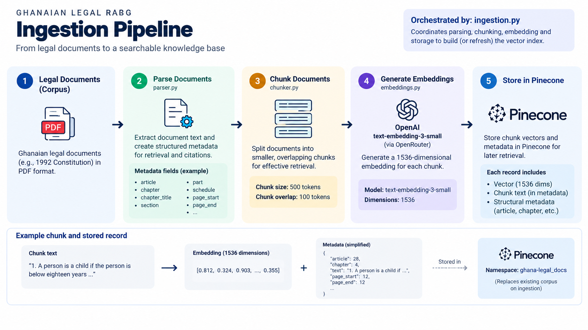
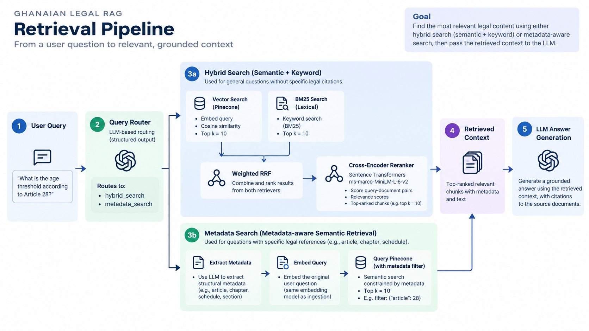

# Ghana Constitution RAG

> A production-oriented Retrieval-Augmented Generation (RAG) system for question answering over the 1992 Constitution of Ghana, built with hybrid retrieval, metadata-aware search, cross-encoder reranking, grounded generation, and automated evaluation.

## Overview

This project implements an end-to-end RAG pipeline for answering questions from the **1992 Constitution of Ghana**.

The system is designed around a core requirement:

> **A legal question should only be answered when the retrieved constitutional context explicitly supports the answer.**

Rather than relying solely on semantic similarity, the system combines **vector retrieval, lexical retrieval, structural metadata filtering, Reciprocal Rank Fusion (RRF), and cross-encoder reranking** to improve retrieval quality.

The generation layer is also designed to **abstain when the retrieved context does not establish an answer**, rather than making unsupported legal inferences.

The system is evaluated continuously using **Ragas** and custom no-answer evaluation, with regression gates integrated into GitHub Actions.

---

## Engineering Highlights

- **Constitution-aware document ingestion** with structural metadata such as chapters, articles, schedules, sections, and page ranges.
- **Semantic vector retrieval** using OpenAI `text-embedding-3-small`.
- **BM25 lexical retrieval** for exact legal terminology and keyword matching.
- **Weighted Reciprocal Rank Fusion (RRF)** implemented to combine lexical and semantic retrieval.
- **LLM-based query routing** between hybrid retrieval and metadata-constrained retrieval.
- **Metadata-aware semantic retrieval** for structurally specific questions such as Article or Chapter references.
- **Cross-encoder reranking** using `cross-encoder/ms-marco-MiniLM-L-6-v2`.
- **Relative reranking score filtering** using a score-margin strategy rather than an absolute score threshold.
- **Grounded generation** with explicit anti-inference and abstention rules.
- **Few-shot prompting** to reinforce safe abstention behavior.
- **Ragas evaluation** across faithfulness, answer correctness, context precision, and context recall.
- **Custom evaluation of unanswerable questions** to detect unsafe answers.
- **Protected evaluation baseline** with regression tolerances.
- **GitHub Actions CI** that evaluates every pull request.
- **Automated PR evaluation reporting** with machine-readable evaluation results.
- **Branch protection** requiring evaluation checks to pass before merging.

---

# Architecture

The system is divided into two primary pipelines:

1. **Offline ingestion and indexing**
2. **Online query and retrieval**

## System Architecture

### Ingestion Pipeline


End-to-end pipeline for parsing the Ghanaian Constitution, extracting structural metadata, generating embeddings, and indexing searchable chunks in Pinecone.

### Retrieval Pipeline


Query-time retrieval pipeline combining semantic, lexical, and metadata-aware retrieval with RRF fusion and cross-encoder reranking before grounded generation.

---

# 1. Document Ingestion

The ingestion pipeline transforms the Constitution PDF into searchable, metadata-rich chunks.

```text
Constitution PDF
      ↓
PDF Parsing
      ↓
Structural Metadata Extraction
      ↓
Chunking
      ↓
Embedding Generation
      ↓
Pinecone
```

### Constitution-aware parsing

The parser extracts both text and constitutional structure, including:

- Chapter
- Chapter title
- Article
- Page range
- Schedule
- Schedule part
- Section
- Document type

This allows the retrieval layer to distinguish between structurally different portions of the Constitution rather than treating the document as an unstructured collection of text.

### Chunking

Documents are split using a recursive character splitter with:

- **Chunk size:** 500 tokens
- **Chunk overlap:** 100 tokens

Each resulting chunk retains its structural metadata.

### Embeddings

Each chunk is embedded using:

**OpenAI `text-embedding-3-small`**

The resulting vectors are stored in Pinecone together with the chunk text and structural metadata.

---

# 2. Query Routing

Incoming questions are passed through an LLM-based query router.

The router determines whether the question is better handled by:

```text
                    User Question
                         │
                    Query Router
                    /           \
                   /             \
          Hybrid Retrieval   Metadata Retrieval
```

### Hybrid retrieval

Used for general questions where both semantic meaning and exact terminology are important.

### Metadata-aware retrieval

Used for structurally specific questions.

For example:

> "What does Article 28 say about the rights of children?"

The system extracts the structural constraint:

```text
article = 28
```

while still embedding the original question and performing semantic retrieval within the metadata-constrained search space.

This avoids relying on metadata alone.

---

# 3. Hybrid Retrieval

The hybrid retrieval pipeline combines two complementary retrieval strategies.

### Semantic retrieval

The question is embedded and compared against the vectors stored in Pinecone.

**Top-k:** 10

### Lexical retrieval

BM25 retrieves documents based on lexical overlap and exact terminology.

**Top-k:** 10

### Weighted Reciprocal Rank Fusion

The two result sets are combined using **Weighted Reciprocal Rank Fusion (RRF)**.

```text
Vector Search ──┐
                ├── Weighted RRF ──→ Candidate Documents
BM25 Search ────┘
```

This allows the system to benefit from:

- semantic similarity
- exact constitutional terminology
- article numbers
- names of institutions
- legal phrases

---

# 4. Cross-Encoder Reranking

The fused candidates are reranked using:

`cross-encoder/ms-marco-MiniLM-L-6-v2`

The cross-encoder evaluates each query-document pair and produces a relevance score.

The system then applies a **relative score-margin filter** rather than assuming the raw CrossEncoder score represents a probability.

The current configuration uses:

```text
SCORE_MARGIN = 1.0
```

Documents are retained when their score is sufficiently close to the highest-ranked candidate.

This was introduced after observing that an absolute threshold could incorrectly discard the best document when its raw relevance score was negative.

---

# 5. Grounded Generation

The final retrieved context is passed to the generation model.

The generation prompt explicitly instructs the model to:

- answer from the retrieved context;
- avoid unsupported legal conclusions;
- distinguish explicit facts from inference;
- verify whether a constitutional provision actually applies to the specific subject asked about;
- avoid treating the absence of a provision as proof of a legal conclusion;
- abstain when the retrieved context does not establish the answer.

### Example

If the context states:

> Public officers retire at 60.

but does not establish that this provision applies to active-duty Ghana Armed Forces officers, the system should **not infer that their retirement age is 60**.

Instead, it abstains.

This behavior is reinforced through few-shot examples in the generation prompt.

---

# Evaluation

Evaluation is treated as a core part of the RAG system rather than an afterthought.

The evaluation dataset currently contains:

- **37 total questions**
- **30 answerable questions**
- **7 unanswerable questions**

## Answerable Evaluation

Answerable questions are evaluated using **Ragas** across four dimensions:

| Metric             | Purpose                                                                     |
| ------------------ | --------------------------------------------------------------------------- |
| Faithfulness       | Measures whether the generated answer is supported by the retrieved context |
| Answer Correctness | Measures answer alignment with the reference                                |
| Context Precision  | Measures the relevance of retrieved context                                 |
| Context Recall     | Measures whether the required information was retrieved                     |

## Unanswerable Evaluation

Unanswerable questions use a custom evaluator to detect whether the system safely abstains.

The important distinction is:

```text
Correct abstention
        ↓
Safe

Unsupported answer
        ↓
Unsafe
```

The evaluation therefore tracks:

- Safe no-answer rate
- Unsafe answer rate
- Clear abstentions
- Abstentions with grounded context
- Unsafe answers

---

# Current Evaluation Results

The current evaluated configuration uses:

```text
SCORE_MARGIN = 1.0
```

Results:

| Metric              |      Score |
| ------------------- | ---------: |
| Faithfulness        | **0.9000** |
| Answer Correctness  | **0.8270** |
| Context Precision   | **0.9833** |
| Context Recall      | **1.0000** |
| Safe No-Answer Rate |   **100%** |
| Unsafe Answer Rate  |     **0%** |

Compared with the protected baseline:

| Metric             | Baseline |    Current |      Change |
| ------------------ | -------: | ---------: | ----------: |
| Faithfulness       |   0.8169 | **0.9000** | **+0.0831** |
| Answer Correctness |   0.7642 | **0.8270** | **+0.0628** |
| Context Precision  |   0.9613 | **0.9833** | **+0.0220** |
| Context Recall     |   0.9839 | **1.0000** | **+0.0161** |

All current regression checks pass.

---

# CI / Evaluation Gates

Every pull request targeting `main` triggers the evaluation workflow.

```text
Pull Request
      ↓
Run RAG Evaluation
      ↓
Ragas + Custom Evaluation
      ↓
Quality Floors
      ↓
Regression Against Baseline
      ↓
PR Evaluation Report
      ↓
PASS ─────────────→ Merge
      │
      FAIL
      ↓
Merge Blocked
```

The evaluation pipeline checks:

- minimum metric thresholds;
- missing metric values;
- unsafe answers to unanswerable questions;
- regression against the protected baseline.

The evaluation results are written to:

```text
evaluation/reports/latest_metrics.json
```

This machine-readable report is consumed by CI to generate a human-readable evaluation report on the pull request.

---

# Project Structure

```text
RAG Project/
│
├── .github/
│   └── workflows/
│       └── evaluate.yml
│
├── data/
│   ├── ghanaian_constitution1992.pdf
│   ├── ground_truth_dataset.json
│   └── rag_predictions.json
│
├── evaluation/
│   ├── notebooks/
│   ├── reports/
│   │   ├── metrics_history/
│   │   ├── baseline_metrics.json
│   │   ├── latest_metrics.json
│   │   ├── latest_report.md
│   │   ├── latest_answerable_results.csv
│   │   ├── latest_unanswerable_results.csv
│   │   ├── failed_answerable_cases.csv
│   │   └── failed_unanswerable_cases.csv
│   │
│   ├── evaluate.py
│   ├── markdown_report.py
│   ├── no_answer_evaluator.py
│   └── run_inference.py
│
├── notebooks/
│
├── prompts/
│   ├── examples.py
│   ├── generation_promptv1.txt
│   ├── generation_promptv2.txt
│   ├── metadata_search_system_prompt.txt
│   └── router_system_promptv1.txt
│
├── src/
│   ├── chunker.py
│   ├── config.py
│   ├── embeddings.py
│   ├── ingestion.py
│   ├── metadata_search.py
│   ├── parser.py
│   ├── prompt.py
│   ├── rag.py
│   ├── reranker.py
│   ├── retrieval.py
│   └── utils.py
│
├── app.py
├── README.md
├── requirements.txt
└── .env.example
```

---

# Tech Stack

## Tech Stack

### Application & AI

- **Python**
- **LangChain**
- **OpenRouter**
- **OpenAI `text-embedding-3-small`**
- **Sentence Transformers**

### Data & Retrieval Infrastructure

- **Pinecone** — vector database
- **BM25** — lexical retrieval implementation

### Evaluation & Observability

- **Ragas** — RAG evaluation
- **LangSmith** — tracing and observability

### CI/CD

- **GitHub Actions** — automated evaluation and regression checks
- **GitHub Pull Requests** — PR-based evaluation workflow

## Engineering Techniques

- **Hybrid Retrieval** — combines semantic vector search with lexical BM25 retrieval.
- **Weighted Reciprocal Rank Fusion (RRF)** — combines results from semantic and lexical retrieval.
- **Metadata-Aware Retrieval** — uses constitutional structure such as articles and chapters to constrain semantic search.
- **Cross-Encoder Reranking** — reranks retrieved candidates based on query-document relevance.
- **Few-Shot Prompting** — reinforces safe answering and abstention behavior.
- **Regression Testing** — compares evaluation results against a protected baseline.
- **Quality Gates** — enforces minimum quality thresholds and prevents unsafe answers from passing CI.

---

# Engineering Decisions

## Why hybrid retrieval?

Legal documents contain both conceptual language and highly specific terminology.

A semantic retriever can identify conceptually related passages, while lexical retrieval is particularly useful for exact terms such as:

```textCouncil of State
Chief Justice
Regional Tribunal
```

Combining both retrieval strategies improves the system's ability to retrieve the appropriate constitutional provisions.

## Why metadata-aware retrieval?

The Constitution has strong hierarchical structure.

A question referring explicitly to:

```text
Article 146
Eg. What does Article 146 say in the constiitution?
```

provides useful structural information that should influence retrieval.

Metadata-aware retrieval allows the system to use that structure without abandoning semantic similarity.

## Why reranking?

Initial retrieval produces a candidate set rather than a final context.

The CrossEncoder provides a second-stage relevance assessment before documents reach the generation model.

This allows the generation model to receive a smaller and more relevant context.

## Why explicit abstention?

A legal RAG system should not turn a plausible inference into an asserted constitutional fact.

The generation layer therefore treats:

```text
retrieved evidence
        ≠
legal conclusion
```

unless the retrieved evidence explicitly establishes the relationship.

---

## Limitations

- The corpus currently focuses on the **1992 Constitution of Ghana** and does not represent the full body of Ghanaian legislation, case law, regulations, or legal commentary.

- The source document used for ingestion is **incomplete**. Chapter 15 and several articles are missing, which means some questions cannot be answered even when the relevant provision exists in the complete Constitution.

- The evaluation dataset currently contains **37 questions**, which provides useful regression coverage but does not represent the full range of constitutional questions and retrieval edge cases.

- The reranking stage uses a **general-purpose cross-encoder** rather than a model specifically trained for legal-domain retrieval.

- The system has **no caching layer**, so repeated requests and evaluation runs may perform the same retrieval, embedding, and LLM operations multiple times, increasing latency and API usage.

---

## Future Improvements

- Expand the evaluation dataset with more constitutional questions and adversarial cases.

- Expand the corpus beyond the Constitution to additional authoritative Ghanaian legal sources.

- Add a user-facing application layer for demonstrating the system interactively.

- Replace the current PDF-based ingestion source with trusted government web sources, allowing the ingestion pipeline to retrieve the Constitution directly from authoritative sources and re-index the corpus when the source content changes.

- Implement caching to reduce repeated computation and external API calls, improving retrieval and evaluation efficiency.

---

# Running the Project

### Install dependencies

```bash
pip install -r requirements.txt
```

### Configure environment variables

Create a `.env` file containing the required credentials, including:

```text
OPENROUTER_API_KEY=
PINECONE_API_KEY=
LANGSMITH_TRACING=
LANGSMITH_ENDPOINT=
LANGSMITH_API_KEY=
LANGSMITH_PROJECT=
```

### Run ingestion

The ingestion pipeline parses the Constitution, creates chunks and embeddings, and indexes them in Pinecone

```bash
python -src.ingestionpp
```

### Run the application

```bash
python-m  apy
```

### Run evaluation

```bash
python -m evaluation.evaluate
```

Evaluation artifacts are written under:

```text
evaluation/reports/
```

---
